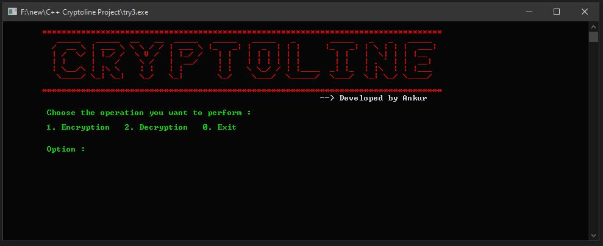
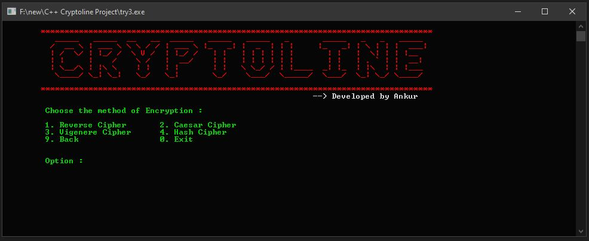
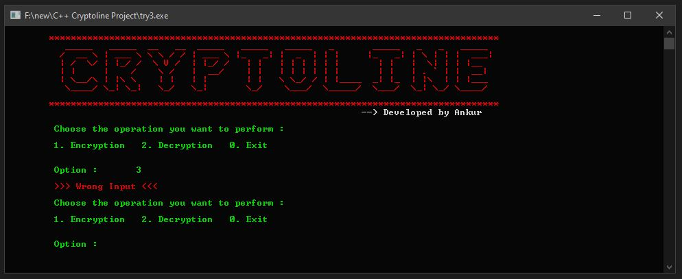
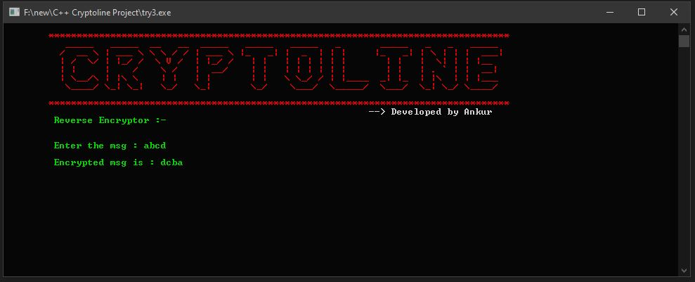
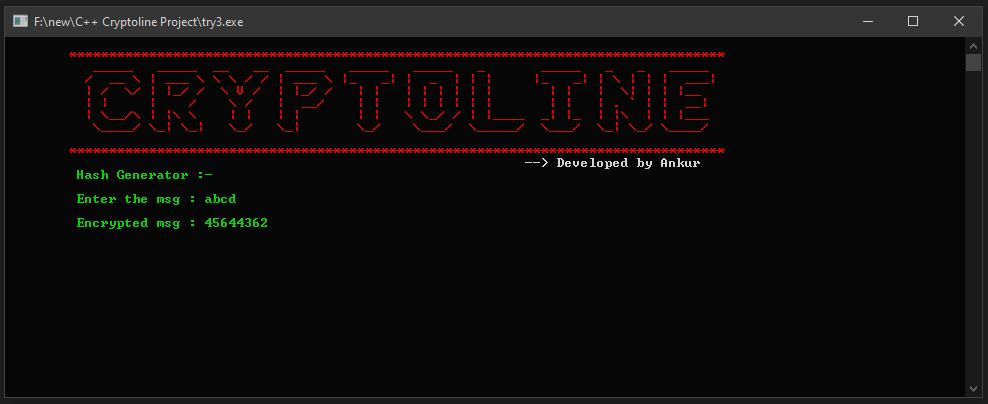
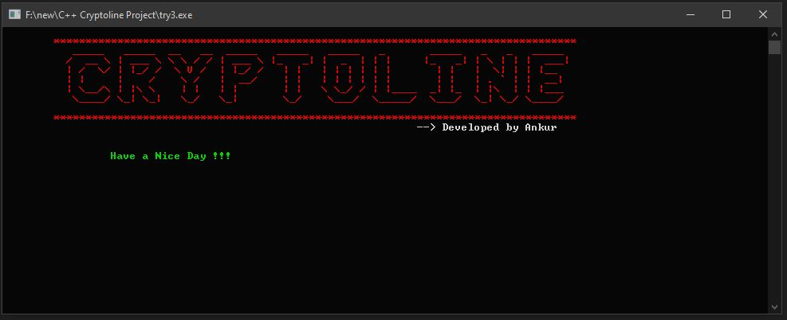

# Cryptoline

## Introduction

The **Cryptoline** is a command-line tool that provides encryption and decryption functionalities using various ciphers. It includes options for encryption and decryption using different methods, such as Reverse Cipher, Caesar Cipher, Vigenere Cipher, and Hash Cipher.








## Features

- **Encryption Methods:**
  - Reverse Cipher
  - Caesar Cipher
  - Vigenere Cipher
  - Hash Cipher (Customized cipher algo completly developed by me)

- **User-Friendly Interface:** The program offers a user-friendly command-line interface with an ASCII art header.

- **Safe Input Handling:** User input is handled securely using `cin` to prevent common input-related issues.

- **Clean and Organized Code:** The code has been optimized for readability and maintainability.

## Prerequisites

Before running the program, make sure you have the following prerequisites installed on your system:

- **C++ Compiler:** You need a C++ compiler installed on your system. Common choices include GCC (GNU Compiler Collection) on Linux, MinGW on Windows, and Xcode Command Line Tools on macOS.

- **Visual Studio Code:** While you can use any text editor, this README assumes you are using Visual Studio Code (VSCode).

- **C/C++ Extension for VSCode:** Install the "C/C++" extension provided by Microsoft in VSCode for a better development experience.

## Installation

1. **Clone the Repository:** Clone this repository to your local machine using Git:

   ```
   git clone https://github.com/Ankur-Kumar-Gupta/Cryptoline.git
   ```

2. **Compile the Code:** Open VSCode, navigate to the project directory, and open the `my_program.cpp` file. Use the integrated terminal to compile the code using the provided `tasks.json`:

   ```
   g++ my_program.cpp -o my_program
   ```

## Usage

1. **Run the Program:** After successfully compiling the code, run the program using the following command:

   ```
   ./my_program
   ```

2. **Choose an Operation:** The program will present a menu allowing you to choose between encryption, decryption, or exiting the program.

3. **Select a Cipher:** Depending on your choice, you will be prompted to select an encryption or decryption method.

4. **Enter Input:** Enter the text you want to encrypt or decrypt when prompted.

5. **View Results:** The program will display the encrypted or decrypted text.

6. **Retry or Exit:** After each operation, you can choose to try again or exit the program.

## Contributing

Contributions to this project are welcome. If you would like to contribute, please follow these steps:

1. Fork the repository.

2. Create a new branch for your feature or bug fix.

3. Make your changes and commit them with clear, concise commit messages.

4. Push your changes to your fork.

5. Submit a pull request to the main repository.

Please ensure your code follows the project's coding standards and conventions.

## License

This project is licensed under the MIT License - see the [LICENSE.md](LICENSE.md) file for details.


## Contact

If you have any questions or feedback, please feel free to contact us:

- Ankur Kumar Gupta - akumarg66@gmail.com
- Project Link: [https://github.com/Ankur-Kumar-Gupta/Cryptoline](https://github.com/Ankur-Kumar-Gupta/Cryptoline)

---
